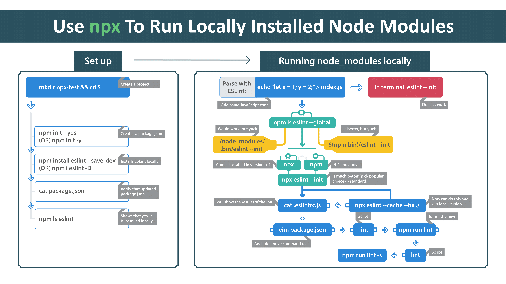

# egghead-npx

This contains the code from the egghead.io npx course

## Flow chart cheat sheets

This course is accompanied with several flow charts (1 per lesson). That show the topic covered in a visual manner for your ease of use.

Check them out:

## Branches

Each lesson from the course has a cooresponding branch that has code or content
relavent to it as well as a corresponding folder found in `/lessons`

1. [lesson-1](./lessons/01-use-npx-to-run-locally-installed-node-modules)
2. [lesson-2](./lessons/02-use-npx-to-temporarily-install-and-invoke-a-package-from-npm)
3. [lesson-3](./lessons/03-test-different-node-module-versions-with-npx)
4. [lesson-4](./lessons/04-use-npx-to-run-commands-with-different-node-js-versions)
5. [lesson-5](./lessons/05-execute-npx-commands-with-npm_-environment-variables)
6. [lesson-6](./lessons/06-execute-code-from-a-remote-github-branch-with-npx)
7. [lesson-7](./lessons/07-use-npx-to-execute-code-from-a-github-gist)

