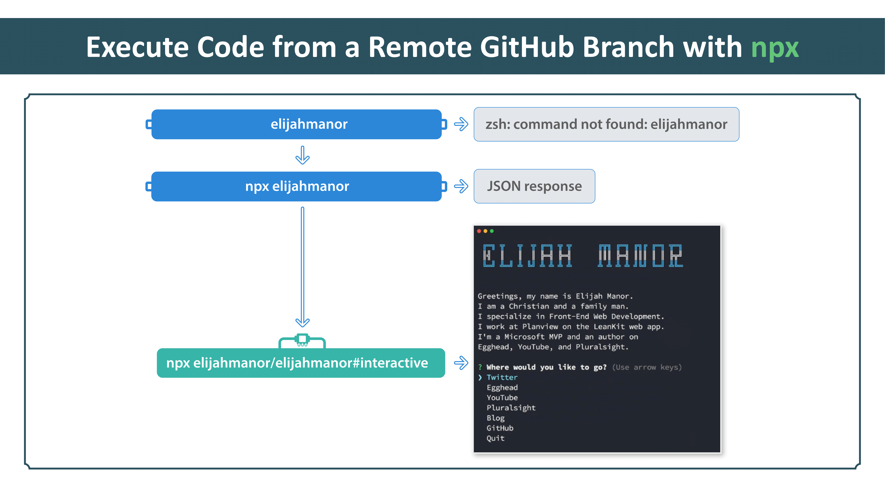

# egghead-npx

This contains the code from the egghead.io npx course

## Lesson 6

This lesson didn't have any code locally. The respoistory in question can be
found on [GitHub](https://github.com/elijahmanor/elijahmanor).

In particular, it referenced the [#interactive](https://github.com/elijahmanor/elijahmanor/tree/interactive) branch.

Here is the topic covered in this lesson:

