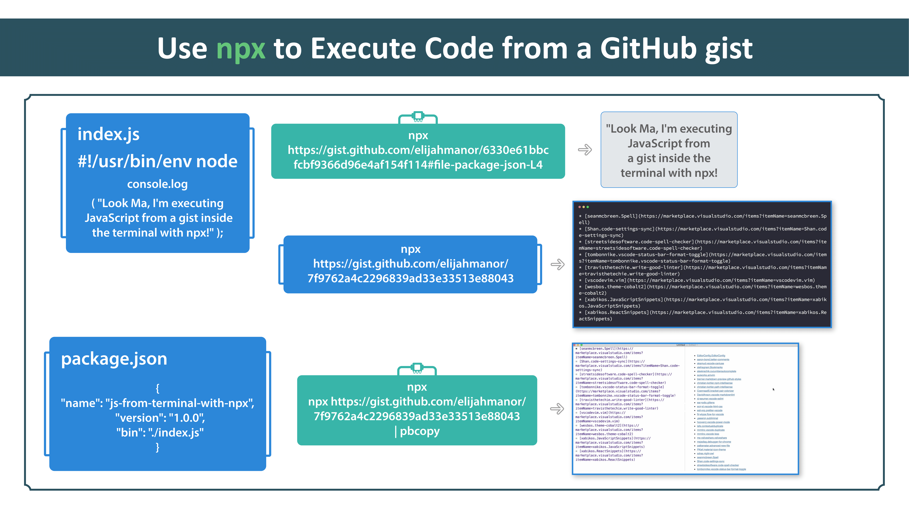

# egghead-npx

This contains the code from the egghead.io npx course

## Lesson 7

This lesson didn't have any code locally. There were two gists that were
mentioned...

1. [Run JavaScript in the terminal from a gist with npx](https://gist.github.com/elijahmanor/6330e61bbcfcbf9366d96e4af154f114) 
2. [Export @code Extensions to a Markdown List](https://gist.github.com/elijahmanor/7f9762a4c2296839ad33e33513e88043)

Here is the topic covered in this lesson:

